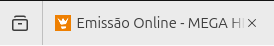
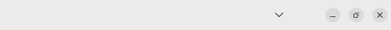

Welcome to my GitHub account profile. This is my homepage.

# Terms & Conditions
 

<ol>
<!--Start of terms & conditions.-->
  <!--1-->
  <li>I will not block any user whatsoever;</li>
   
    <ol>
      <!--1.1-->
      <li>I'll block a user if, from my newbie experience, I'll permit any sort of unintended mess on one of the public repositories that I display in my account;</li>
       
      <!--1.2-->
      <li>You have to understand that this is a differnt kind of social network;</li>
       
        <ol>
          <!--1.2.a-->
          <li>I may have you blocked in another social media platform. This is due two main reasons: (1) I don't like you, and (2) you lack of personality in the moment where you came to mess around with me.</li>
           
        </ol>
    </ol>

  <!--2-->
  <li>We may delete any public repository at any time;</li>
   
    <ol>
      <!--2.1-->
      <li>We encourage you to download the repository, or/and keep up with it as soon as possible.</li>
       
    </ol>

  <!--3-->
  <li>Any state inside a repository (code or other forms) aren't intended to be the best practices.</li>
   
    <ol>
      <!--3.1-->
      <li>Some times, the practices aren't even correct.</li>
       
    </ol>
<!--End of terms & conditions.-->
</ol>
  

 

> *One day I'll right you a Book, or 7.*
<!-- -->

<!----><!--MegaHits--><!----><!--Manager-->
<!----><!--Luisa Sonza-->
